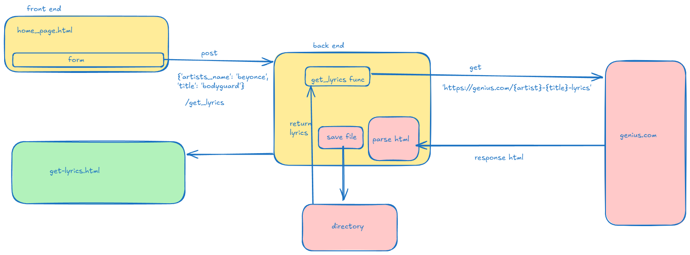

# Sounds and Lyrics
This project requests the user to provide the name of an artists and title of the lyrics they desire, and retrieves the lyrics via web scraping.

## Description:

FastAPI project that uses BeautifulSoup, Jinja2 templating, requests library, and the uvicorn web server.

 

### Prerequisites:

Python 3.12.5 or later and
pip (package installer for Python)

Installation:
```bash
pip install fastapi, requests, uvicorn, beautifulsoup4, jinja2

```
or install using the requirements.txt file
```bash
pip install -r requirements.txt
```

Getting started:
```bash
python -m uvicorn main:app --reload
```
